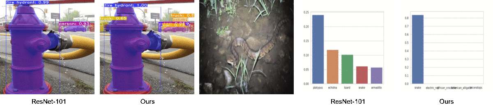

# Delving-Deeper-Into-Anti-Aliasing-in-ConvNets

This work is accepted in **BMVC2020** as ***Oral presentation***. It introduces a plugin module in neural network to improve both model accuracy and consistency.

\[[Project page](https://maureenzou.github.io/ddac/)\] | \[[arXiv](https://maureenzou.github.io/ddac/)\] | \[[Slide](https://drive.google.com/file/d/1rX_LRfLCwr3nbX3jmpdKlz9L2S8GrrHS/view?usp=sharing)\] | \[[Video](https://www.youtube.com/watch?v=R8eSs6Cljvc)\] | \[[视频](https://www.bilibili.com/video/BV1aD4y127MF/)\]



## Progress
- [x] Image Classification
- [ ] Instance Segmentation
- [ ] Semantic Segmentation

## Installation

## Dataset

## File Structure

## Model Zoo

## Testing

```
python main.py --data ../../data/ILSVRC2012 -f 5 -e -b 32 -a resnet101_pasa_group_softmax --group 8 --weights /pth/to/model
```

## Training
```
python main.py --data ../../data/ILSVRC2012 -f 3 -b 128 -ba 2 -a resnet101_pasa_group_softmax --group 8 --out-dir /pth/to/output/dir
```
